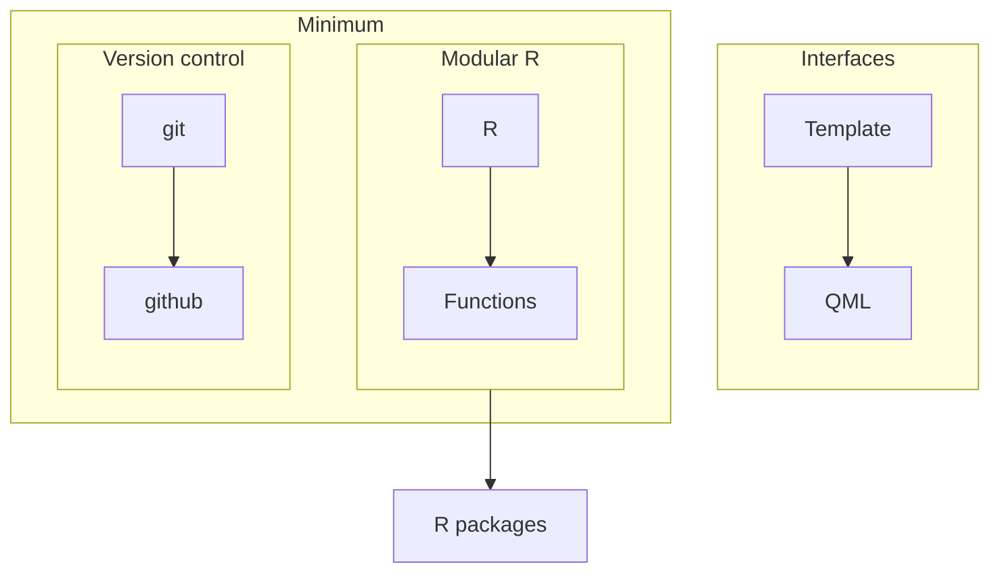

# Required background
In order to contribute to JASP, you'll need to be at least familiar with a couple of concepts:

## Minimum
- Using version control with `git` and [GitHub](https://github.com)
- Writing modular R code by using functions

## Advanced
- Writing R packages
- Writing interfaces in QML language

## The same, but graphically

Please take a look at the learning materials below if you want to learn more about these topics.

## Learning materials
### git and GitHub
- Software carpentry [lessons](https://swcarpentry.github.io/git-novice/)
	- 1-6 for learning git
	- 7-9 for learning GitHub
	- 10-14 optional
		- 14, _Using git from RStudio_, is particularly relevant
### R and Functions
- Software carpentry [R for reproducible data analysis](https://swcarpentry.github.io/r-novice-gapminder/)
	- 1-9 cover the basics
	- 10 covers functions
	- 11-15 are quite good, but optional
### R packaging
- Software carpentry [lessons](https://carpentries-incubator.github.io/lesson-R-packaging/)
	- 1-7 cover the basics, including unit testing and dependency management
	- 9-10 are quite good, but optional
### Interface building with QML files
- The best way to learn this is by following [the tutorial](https://github.com/PabRod/jasp-desktop/blob/tutorial/Docs/development/jasp-modules-tutorial.md), which includes a ready-to-use [template](https://github.com/jasp-stats/jaspModuleTemplate)